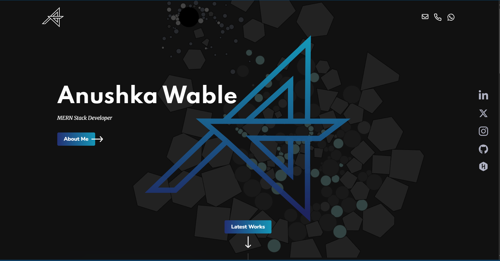
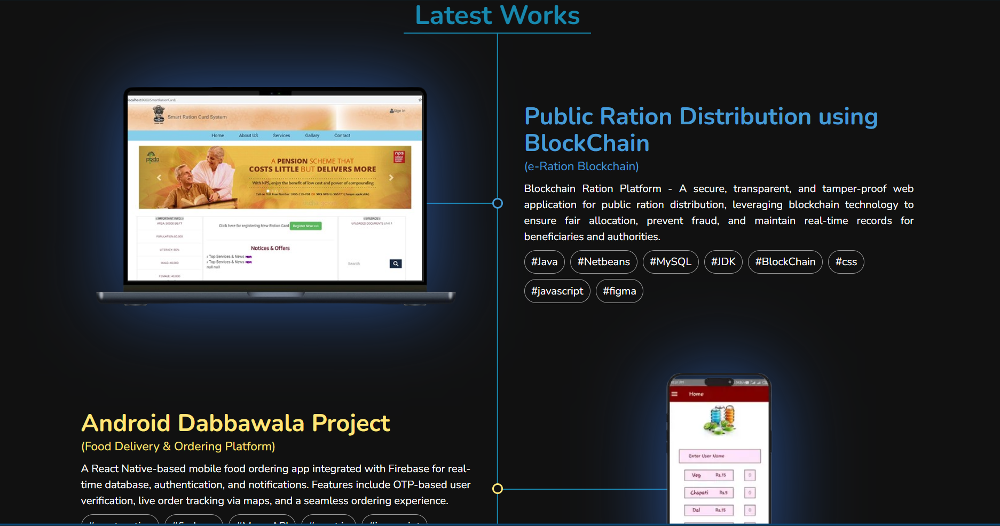

# 🌟 Portfolio-Website  

Portfolio website built using HTML5, CSS3, JavaScript, and Matter.js.

## ✨ Features
- 🎨 Modern UI with smooth animations
- 📱 Fully responsive (mobile-friendly)
- 💼 Project showcase with live links
- 📬 Contact form integration

## 📌 Tech Stack

### Extras:
Matter.js, Swiper.js, Animation, Scroll Reveal, Font Nunito, JSON

---

## 📌 Sneak Peek of Main Page 🙈

---

## 📬 Contact Me
**Your Name**  
📧 [your.email@example.com](mailto:anushka.wable2002@gmail.com)  
💼 [LinkedIn](https://www.linkedin.com/in/anushka-wable-245256232/) | 🐦 [Twitter](https://x.com/Anushks361472)
