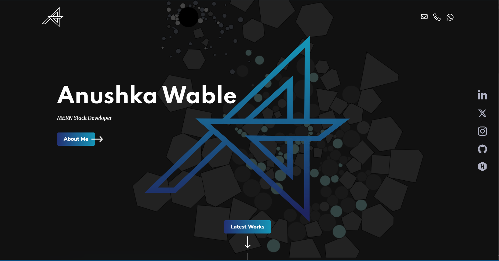
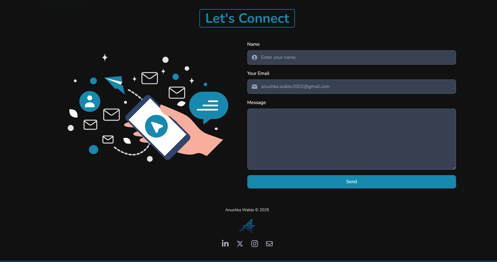

# 🌟 Portfolio-Website  

Portfolio website built using HTML5, CSS3, JavaScript, and Matter.js.

---

🔗 **Live Demo:** [View Portfolio](https://anushkawable.netlify.app/)

----

## ✨ Features
- 🎨 Modern UI with smooth animations
- 📱 Fully responsive (mobile-friendly)
- 💼 Project showcase with live links
- 📬 Contact form integration
  

## 📌 Tech Stack

### Extras:
Matter.js, Swiper.js, Animation, Scroll Reveal, Font Nunito, JSON

---

## 📌 Sneak Peek of Main Page 

----

---

## 📬 Contact Me
**Anushka Wable**  

Give a star to my repository ⭐

